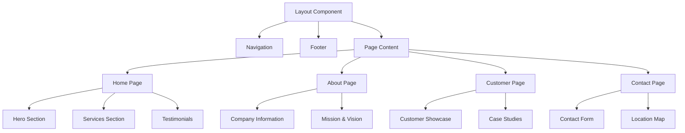

# System Patterns: P.P EV Energy Co., Ltd. Website

## System Architecture
This website is built using a modern stack with Next.js and Tailwind CSS:

- **Next.js**: Provides server-side rendering, static site generation, and routing capabilities
- **React**: Component-based UI development
- **Tailwind CSS**: Utility-first CSS framework for styling
- **TypeScript**: For type safety and improved developer experience

## Key Technical Decisions
1. **Next.js Framework**: Selected for its SEO benefits, performance optimization, and built-in routing
2. **Tailwind CSS**: Chosen for rapid UI development and consistent styling
3. **TypeScript**: Implemented for code quality and maintainability
4. **Responsive Design**: Mobile-first approach to ensure compatibility across all devices
5. **Component-Based Architecture**: Reusable components for consistency and maintainability

## Design Patterns in Use
- **Page-based Routing**: Utilizing Next.js file-based routing system
- **Component Composition**: Building complex UI from smaller, reusable components
- **Responsive Layout**: Using Tailwind's responsive utility classes
- **Static Site Generation (SSG)**: For optimal performance and SEO
- **Centralized Theme Configuration**: Company colors defined in Tailwind config

## Component Relationships

This architectural pattern ensures separation of concerns while maintaining a cohesive user experience throughout the website.
